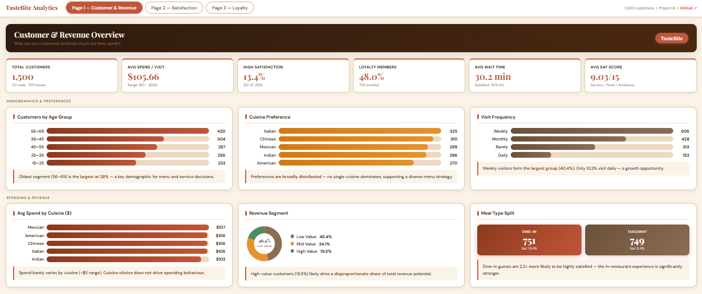
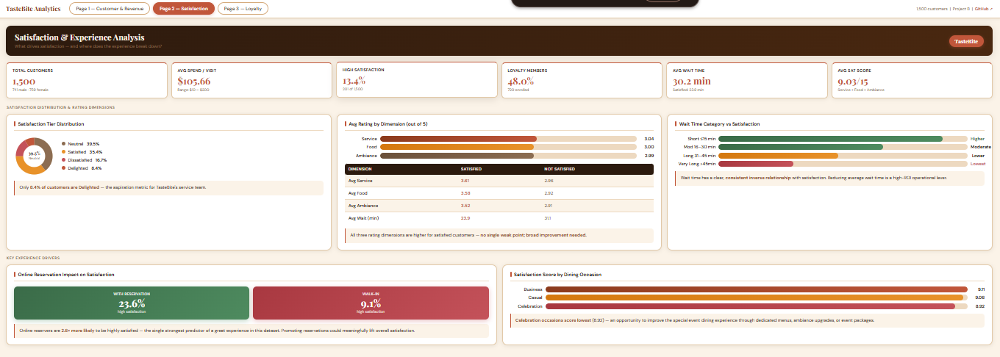
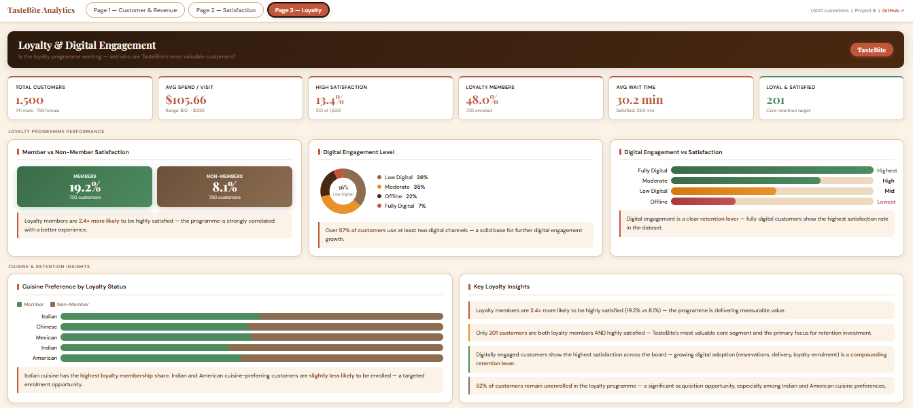

# 🍽️ The Taste Bite Project

> **A full-cycle data analytics portfolio project** covering data cleaning, feature engineering, relational database design, SQL analysis, interactive dashboard prototyping, and professional client-facing reporting — completed as the ALX Data Analytics Programme capstone (Group 6, Project B).
> 
https://github.com/Tosa-omokhoa/The-Taste-Bite-Project/blob/main/dasboard/tastebite_dashboard.html
---

## 📊 Dashboard Preview

### Page 1 — Customer & Revenue Overview


### Page 2 — Satisfaction & Experience Analysis


### Page 3 — Loyalty & Digital Engagement


> 💡 **Open `tastebite_dashboard.html` in any browser** for the fully interactive, responsive version with animated bars, working page navigation, and hover tooltips.

---

## 📋 Table of Contents

- [Project Overview](#project-overview)
- [My Role](#my-role)
- [Dataset](#dataset)
- [Project Phases](#project-phases)
- [Key Findings](#key-findings)
- [Repository Structure](#repository-structure)
- [Tools & Technologies](#tools--technologies)
- [How to Use This Repository](#how-to-use-this-repository)
- [Future Work](#future-work)
- [Author](#author)

---

## Project Overview

**TasteBite** is a restaurant brand operating in a competitive, customer-driven market. This project uses customer-level data to uncover patterns in demographics, spending behaviour, dining preferences, wait time experience, and loyalty programme performance.

The central challenge revealed by the analysis: **only 13.4% of TasteBite's 1,500 tracked customers are highly satisfied** — yet the data also reveals clear, actionable levers that can meaningfully improve this figure. The project delivers a complete analytics pipeline from raw data through to strategic recommendations, supported by SQL analysis, an interactive HTML dashboard, and a professional report.

---

## My Role

I served in a **dual capacity** on this project:

| Role | Responsibilities |
|------|-----------------|
| **Team Lead / Project Manager** | Scoping the analytical brief, coordinating the Group 6 sub-teams, directing the SQL phase, managing deliverable timelines, and overseeing quality across all phases |
| **Data Analyst** | End-to-end data cleaning, feature engineering (12 new analytical columns), exploratory and business intelligence analysis, dashboard design, and report authorship |

---

## Dataset

| Attribute | Detail |
|-----------|--------|
| **Source** | TasteBite restaurant customer database |
| **Records** | 1,500 unique customers |
| **Original Fields** | 19 (demographics, ratings, preferences, behaviour) |
| **Engineered Features** | 12 (age bands, satisfaction tiers, revenue segmentation, digital engagement, etc.) |
| **Null Values** | 0 |
| **Duplicate Records** | 0 |

### Original Columns
`CustomerID` · `Age` · `Gender` · `Income` · `VisitFrequency` · `AverageSpend` · `PreferredCuisine` · `TimeOfVisit` · `GroupSize` · `DiningOccasion` · `MealType` · `OnlineReservation` · `DeliveryOrder` · `LoyaltyProgramMember` · `WaitTime` · `ServiceRating` · `FoodRating` · `AmbianceRating` · `HighSatisfaction`

### Feature-Engineered Columns Added
| Column | Description |
|--------|-------------|
| `Age_Group` | Equal 10-year bands (18–25 through 56–69) |
| `Income_Band` | Four tiers: Low / Lower-Mid / Upper-Mid / High |
| `Satisfaction_Score` | Composite score: Service + Food + Ambiance (3–15) |
| `Satisfaction_Tier` | Dissatisfied / Neutral / Satisfied / Delighted |
| `Spend_Tier` | Low / Mid / High / Premium |
| `Wait_Time_Category` | Short / Moderate / Long / Very Long |
| `Group_Type` | Solo / Small / Medium / Large |
| `Digital_Engagement_Score` | Count of digital channels used (0–3) |
| `Digital_Engagement_Level` | Offline → Fully Digital |
| `Revenue_Potential` | Average Spend × Visit Frequency weight |
| `Revenue_Segment` | Low / Mid / High Value customer tier |
| `Loyal_and_Satisfied` | Binary flag: loyalty member AND highly satisfied |

---

## Project Phases

```
Phase 1 ── Data Cleaning & Feature Engineering      Python (pandas, openpyxl)
Phase 2 ── Relational Database Design & SQL         MySQL 8.0
Phase 3 ── Dashboard Design & Visualisation         HTML / CSS / JS
Phase 4 ── Professional Analytics Report            Python (docx)
Phase 5 ── GitHub Repackaging & Publication         Git / GitHub
```

### Phase 1 — Data Cleaning & Feature Engineering
The raw dataset was loaded, cleaned (data types corrected, column names standardised), and expanded from 19 to 31 analytical columns through feature engineering. The working file includes a full **Data Dictionary** sheet and a **Summary Stats** sheet.

### Phase 2 — SQL Analysis
A 4-table normalised MySQL schema was designed (Customers, Visits, Preferences, Feedback) with foreign key constraints, ENUM types, and CHECK constraints. **22 analytical queries** were written across two tiers:
- **12 Exploratory queries** (Q1–Q12): customer distribution, spend analysis, satisfaction by segment, wait time impact, dining occasion, digital engagement
- **10 Business Intelligence queries** (BI-1–BI-10): CTEs, window functions (`RANK()`, `SUM() OVER()`), cumulative revenue analysis, cross-tabulations, top customer profiling
- **3 reusable Views** for Power BI / dashboard integration

### Phase 3 — Dashboard & Visualisation
A **3-page interactive HTML dashboard** was built as a responsive prototype, styled with TasteBite's warm terracotta brand palette. Pages cover:
1. Customer & Revenue Overview
2. Satisfaction & Experience Analysis
3. Loyalty & Digital Engagement

### Phase 4 — Professional Report
A 9-section client-facing analytics report covering full methodology, all findings, 6 strategic recommendations with expected impact, data limitations, and future work directions.

---

## Key Findings

| # | Finding | Data Point |
|---|---------|-----------|
| 1 | Overall satisfaction is critically low | Only **13.4%** of customers are highly satisfied |
| 2 | Online reservations are the strongest satisfaction predictor | Reservers: **23.6%** vs walk-ins: **9.1%** (2.6× gap) |
| 3 | Dine-in dramatically outperforms takeaway | Dine-in: **18.4%** vs Takeaway: **8.4%** (2.2× gap) |
| 4 | Wait time has a direct inverse relationship with satisfaction | Short wait (≤15 min): **20.2%** · Very Long (>45 min): **8.1%** |
| 5 | Loyalty members are significantly more satisfied | Members: **19.2%** vs Non-members: **8.1%** (2.4× gap) |
| 6 | Digital engagement is the strongest compound predictor | Fully Digital: **51.0%** · Offline: **3.4%** (15× gap) |
| 7 | High-value customers (19.5%) generate 78.5% of revenue potential | Top two revenue tiers produce **$302,652** of $380,538 total |
| 8 | Celebration occasions produce the highest high-satisfaction rate | **19.5%** despite lowest composite score |

---

## Repository Structure

```
The-Taste-Bite-Project/
│
├── 📊 TasteBites_restaurant_customer_satisfaction_RawFile.xlsx
│      Raw dataset (1,500 rows × 19 columns) — untouched source file
│
├── 🔧 TasteBite_Working_Data_Cleaned+Feature_Engineering.xlsx
│      Cleaned & engineered dataset (1,500 rows × 31 columns)
│      Includes: Working_Data · Data_Dictionary · Summary_Stats
│
├── 🗄️  TasteBite_SQL_Project.sql
│      Full MySQL script — schema, normalisation, 22 queries, 3 views
│
├── 🌐 tastebite_dashboard.html
│      3-page responsive interactive HTML dashboard prototype
│      Open directly in any browser — no installation required
│
├── 📄 TasteBite_Analytics_Report.docx
│      9-section professional client-facing analytics report
│
├── 🖼️  screenshots/
│      dashboard_page1_customer_revenue.png
│      dashboard_page2_satisfaction.png
│      dashboard_page3_loyalty.png
│
└── 📖 README.md
       This file
```

---

## Tools & Technologies

| Tool | Purpose |
|------|---------|
| **Python** (pandas, openpyxl) | Data cleaning, feature engineering, report generation |
| **MySQL 8.0** | Relational schema design, SQL analysis, stored views |
| **HTML / CSS / JavaScript** | Interactive responsive dashboard prototype |
| **Power BI** | Production dashboard (planned — see Future Work) |
| **Microsoft Excel** | Working data file with Data Dictionary and Summary Stats |

---

## How to Use This Repository

### View the Dashboard
Open `tastebite_dashboard.html` in any modern browser (Chrome, Firefox, Edge, Safari). No server, no installation — fully self-contained.

### Run the SQL Analysis
1. Open MySQL Workbench (or any MySQL 8.0+ client)
2. Run `TasteBite_SQL_Project.sql` top-to-bottom
3. Before Section 2 (Data Population), import the working data CSV into `tastebite_staging` via the Table Data Import Wizard
4. All 22 queries and 3 views will be ready after execution

### Explore the Data
Open `TasteBite_Working_Data_Cleaned+Feature_Engineering.xlsx` — use the **Data_Dictionary** sheet to understand every column, and **Summary_Stats** for a pre-computed overview.

### Read the Report
Open `TasteBite_Analytics_Report.docx` in Microsoft Word. Fully self-contained.

---

## Future Work

- [ ] **Power BI production dashboard** — full 3-page rebuild using the HTML prototype as the design reference and the SQL views as the data source
- [ ] **Tableau version** — parallel Tableau dashboard for cross-platform portfolio demonstration
- [ ] **Predictive churn model** — use engineered features to predict which customers are most at risk of disengaging
- [ ] **Longitudinal analysis** — track customer visit patterns over time when time-series data becomes available
- [ ] **NPS integration** — add a Net Promoter Score metric alongside existing satisfaction measures

---

## Author

**Omokhoa Oshose Tosayoname**
*Team Lead & Data Analyst — Group 6, ALX Data Analytics Programme*

[](https://github.com/Tosa9)

---

*Project B — ALX Data Analytics Programme · April 2026*
